# Lab 2 · Meet the OS You Will Build

**Olga Saban, FAF-242** · UTM, FCIM · Operating Systems · 5 October 2026

The figures below are screenshots of my own terminal session, in the order I ran the commands. I worked on an Ubuntu VM over SSH, starting from a fresh clone of upstream `mit-pdos/xv6-riscv`.

## Part 1. Build it and boot it

On the VM I cloned the repository, checked its contents and ran `make qemu`.

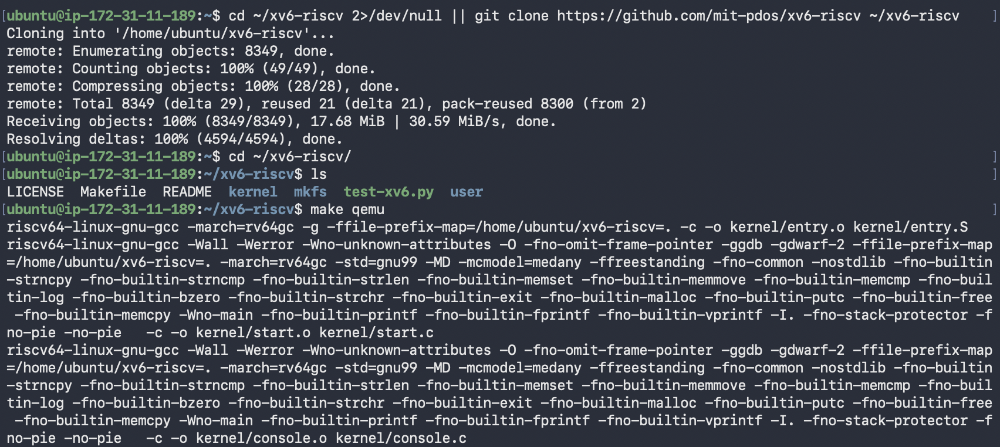

*Figure 1. Cloning xv6-riscv and starting the build with `make qemu`.*

Every file is compiled with `riscv64-linux-gnu-gcc -march=rv64gc`. This is a cross-compiler: it runs on the VM but produces machine code for a RISC-V CPU. QEMU then emulates a RISC-V machine and boots the kernel that was just built.

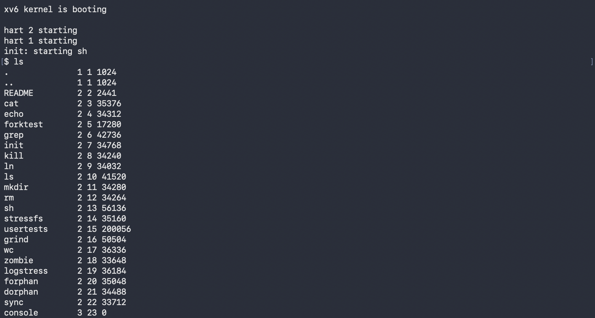

*Figure 2. xv6 boots, starts the shell, and `ls` lists the root directory.*

The lines `hart 2 starting` and `hart 1 starting` are the extra CPU cores coming online. "Hart" is the RISC-V term for a hardware thread, and QEMU is started with `-smp 3`, so there are three of them. After that `init` launches the shell and the `$` prompt appears.

## Part 2. Use xv6 as the Unix it is

Inside xv6 I tried a few basic commands.

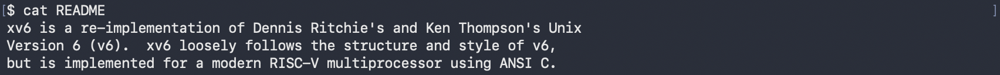

*Figure 3. Start of `cat README` (the rest of the file is cut).*

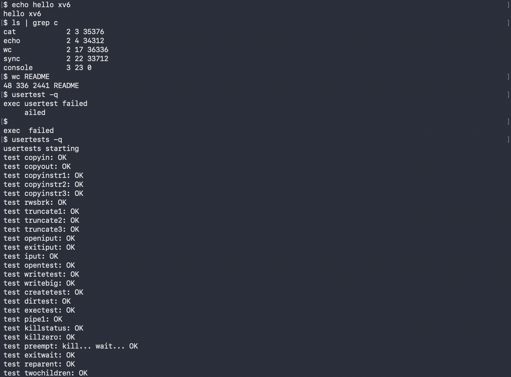

*Figure 4. `echo`, the pipe `ls | grep c`, `wc README`, a mistyped `usertest`, then `usertests -q`.*

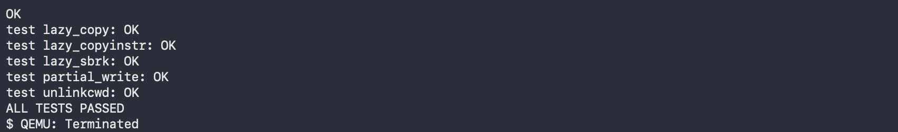

*Figure 5. End of `usertests -q` with `ALL TESTS PASSED`, then QEMU closed with Ctrl-A, X.*

**1. Three programs xv6 ships with**

`ls`, `cat` and `grep`. It also includes `echo`, `wc`, `mkdir`, `rm`, `kill`, `sh` and test programs such as `usertests`.

**2. Which two OS features must exist for a pipe to work?**

- **Processes.** The shell uses `fork()` to create two processes and `exec()` to load `ls` and `grep` into them, so both run at the same time.
- **Inter-process communication.** `pipe()` gives a kernel buffer with a read end and a write end (two file descriptors). The shell attaches the output of `ls` to the write end and the input of `grep` to the read end, so the data passes from one process to the other through the kernel.

**3. xv6 shell vs the Linux shell from Lab 1**

The core is the same: running programs, pipes, `<` and `>` redirection, `&` and `;`. Everything else is missing. There is no history, no tab completion, no variables and no wildcards. Error messages are minimal too. My typo `usertest` only produced `exec usertest failed` (Figure 4), where Linux would say "command not found" and often suggest the right name.

**Interesting output**

xv6's `ls` prints the name, type, inode number and size of each entry. Type `1` is a directory, `2` a regular file and `3` a device, so `console 3 23 0` is the terminal exposed as a file, the same idea as `/dev/console` in Lab 1. `wc README` returned `48 336 2441` (lines, words, bytes), and 2441 is exactly the size `ls` shows for README. `usertests -q` ended with `ALL TESTS PASSED`, which confirms the kernel I built works.

## Part 3. Read the source

After quitting QEMU I read some of the source on the VM.

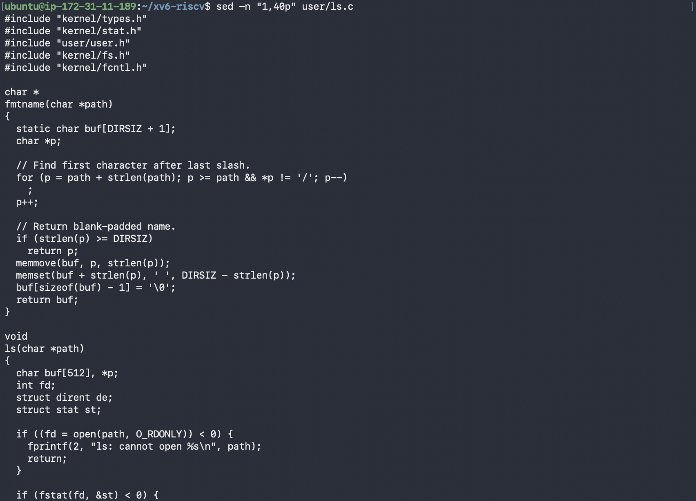

*Figure 6. `sed -n "1,40p" user/ls.c`.*

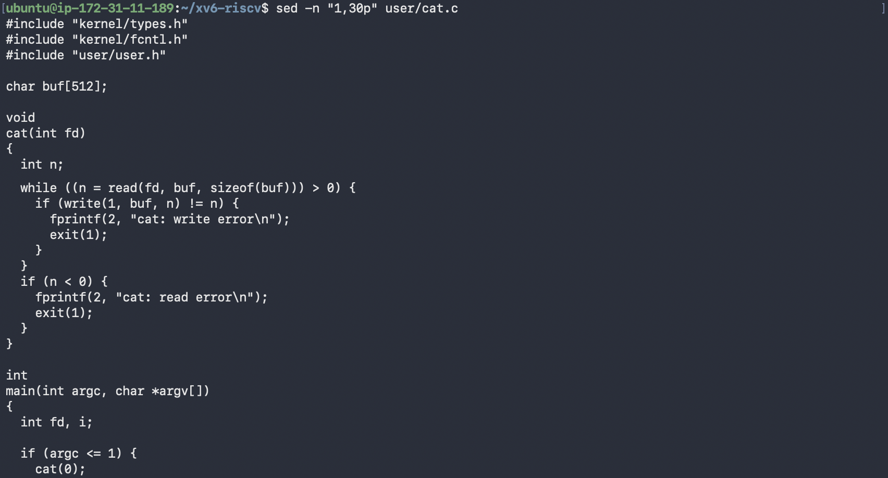

*Figure 7. `sed -n "1,30p" user/cat.c`.*

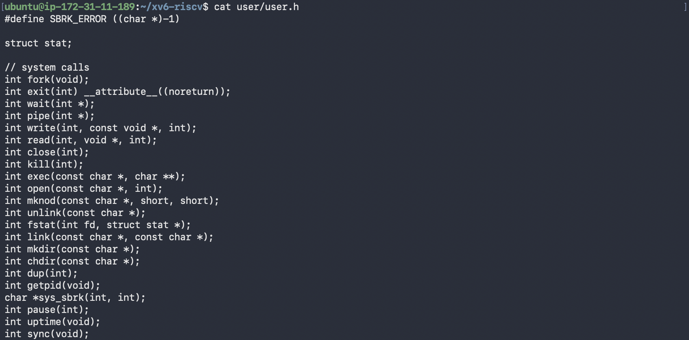

*Figure 8. The system call section of `user/user.h`.*

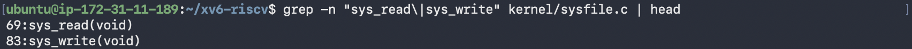

*Figure 9. `grep` for `sys_read` and `sys_write` in `kernel/sysfile.c`.*

**1. Which system calls does `user/cat.c` use, and what does each ask the kernel?**

- `read(fd, buf, sizeof(buf))` asks the kernel to copy up to 512 bytes from an open file into `buf`. It returns the number of bytes read, or `0` at end of file.
- `write(1, buf, n)` asks the kernel to send `n` bytes to file descriptor 1, the standard output (the console).
- `exit(1)` asks the kernel to terminate the process and pass the status to its parent.
- `open()` and `close()` appear further down in `main`, to open each file given on the command line and release it afterwards.

`fprintf(2, ...)` is not a system call. It is a library function from `printf.c` that eventually calls `write()` on fd 2 (standard error).

**2. Where is `sys_read` implemented?**

In `kernel/sysfile.c` at line 69, with `sys_write` at line 83 (Figure 9).

**3. Difference between `kernel/` and `user/`**

`kernel/` is the operating system itself. It runs in privileged (supervisor) mode with full access to memory and devices. `user/` contains ordinary programs that run in unprivileged user mode, and the only way they can do anything outside their own memory is to ask the kernel through the system calls declared in `user/user.h`.

**Interesting output**

Figure 8 shows that the entire interface between programs and the kernel is 22 system calls, while Linux has several hundred. It also shows that this version has no `sleep()` declaration, only `pause(int)`, which turned out to matter in Part 4.

## Part 4. My first xv6 program

My first attempts to create `user/sleep.c` with a one-line `echo` failed, because bash treated `<ticks>` inside the string as a redirection. I switched to a heredoc (`cat > user/sleep.c << 'EOF'`) with the code from the lab sheet.

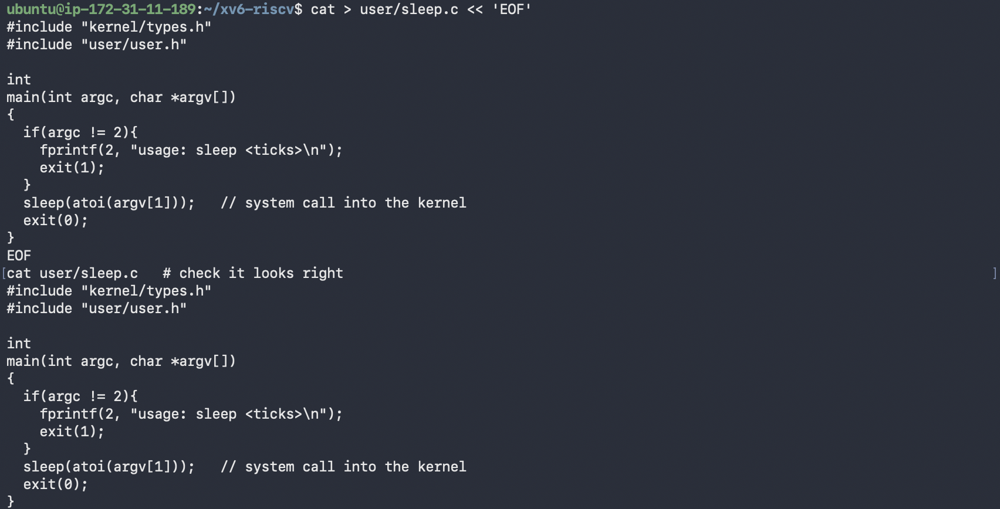

*Figure 10. Writing `user/sleep.c` with a heredoc and printing it back.*

Next I opened the `Makefile` in vim and added one line to `UPROGS`, indented with a tab like the other entries:

```make
UPROGS=\
	$U/_cat\
	$U/_echo\
	$U/_sleep\
	$U/_forktest\
	...
```

The first build failed with `implicit declaration of function 'sleep'`. In current upstream xv6 the sleep system call has been renamed to `pause()` (`user/user.h` line 25, implemented as `sys_pause` in `kernel/sysproc.c`). It does the same thing the lab describes, waiting for a number of clock ticks, so I replaced the call with `sed` and checked the result with `grep`. The program is still called `sleep`.

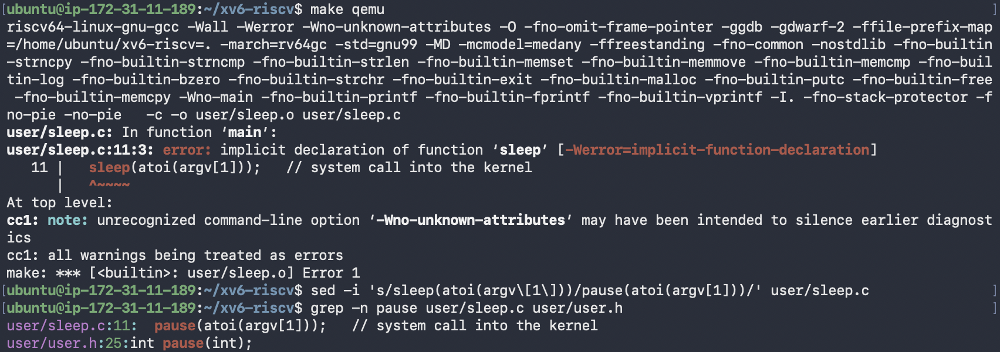

*Figure 11. Build error for `sleep()` and the switch to `pause()`.*

Final `user/sleep.c`:

```c
#include "kernel/types.h"
#include "user/user.h"

int
main(int argc, char *argv[])
{
  if(argc != 2){
    fprintf(2, "usage: sleep <ticks>\n");
    exit(1);
  }
  pause(atoi(argv[1]));   // system call into the kernel
  exit(0);
}
```

Then I rebuilt and tested it inside xv6.

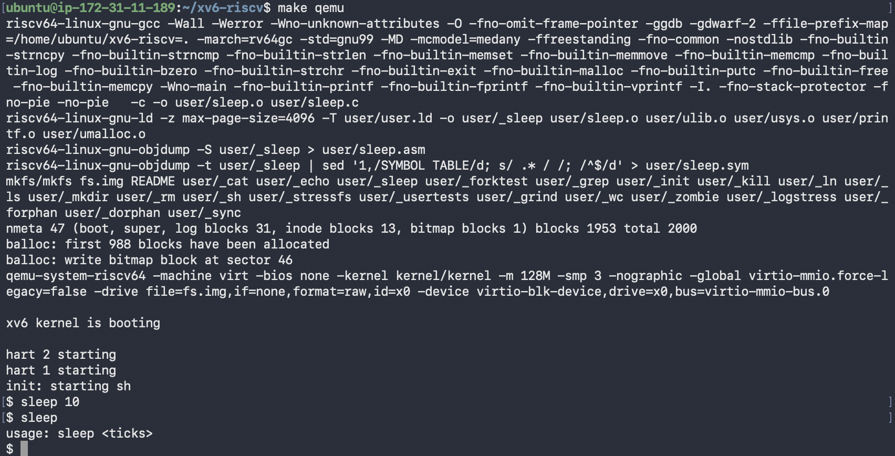

*Figure 12. Successful rebuild, then `sleep 10` and `sleep` with no argument inside xv6.*

The `mkfs` line now includes `user/_sleep`, so the program was packed into the xv6 disk image. Inside xv6, `sleep 10` paused before returning to the prompt. One tick is roughly 0.1 s in QEMU, so that is about one second. Running `sleep` without an argument printed `usage: sleep <ticks>`, so the argument check works as well.
