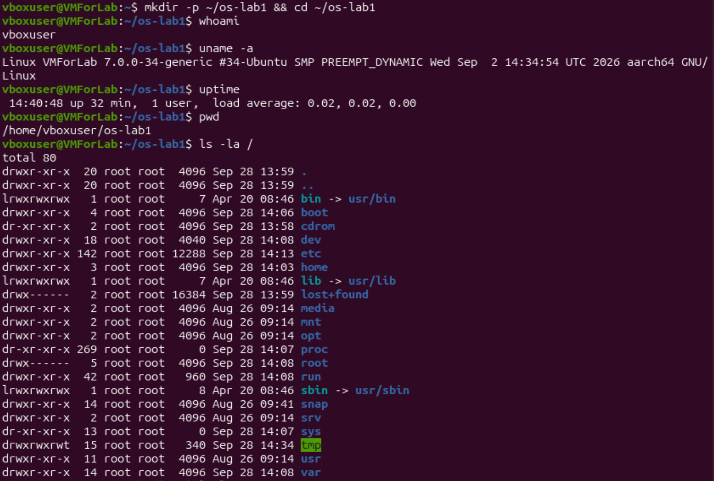
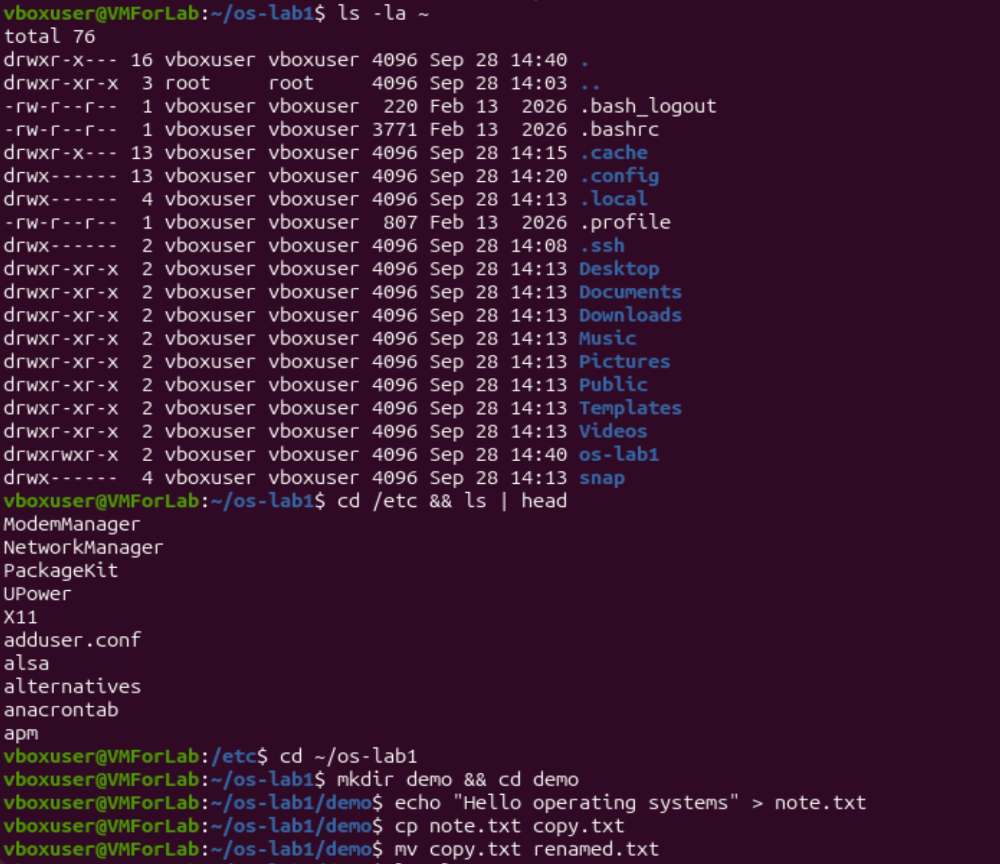
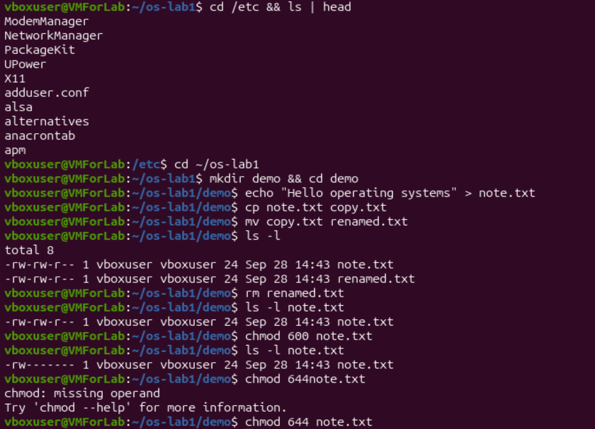
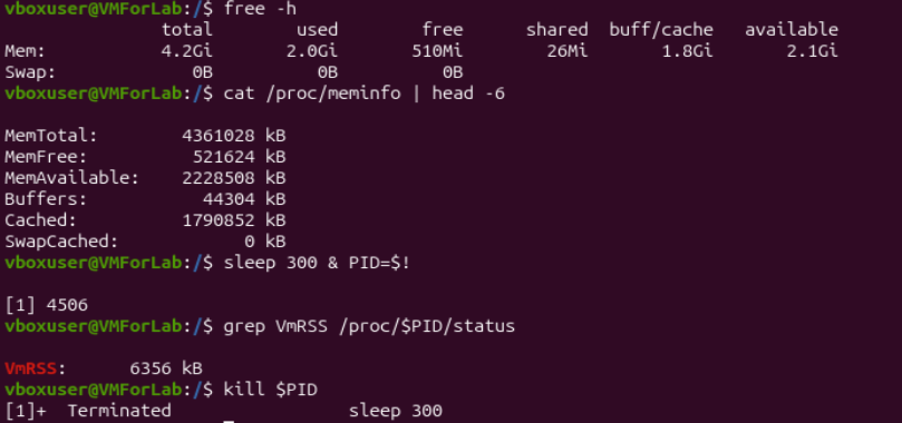
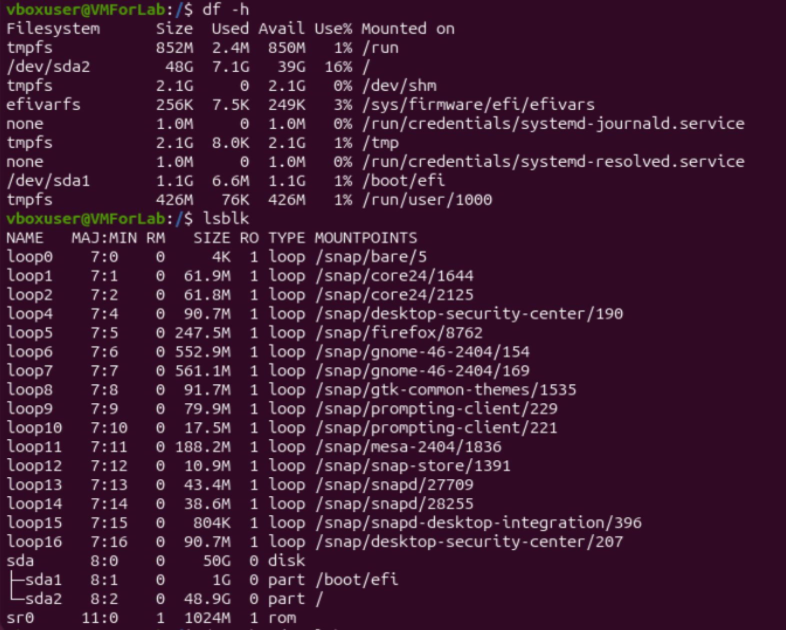
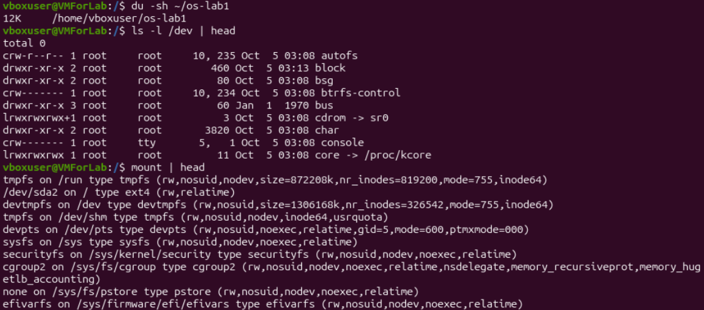

# Lab 1 — The OS as a Resource Manager (Track A, Linux)

**Student:** Saban Olga, FAF-242 
**VM:** `vboxuser@VMForLab` (Ubuntu, Linux 7.0.0-34-generic, aarch64)

## Setup

```
$ mkdir -p ~/os-lab1 && cd ~/os-lab1
$ whoami
vboxuser
$ uname -a
Linux VMForLab 7.0.0-34-generic #34-Ubuntu SMP PREEMPT_DYNAMIC Wed Sep  2 14:34:54 UTC 2026 aarch64 GNU/Linux
$ uptime
 14:40:48 up 32 min,  1 user,  load average: 0.02, 0.02, 0.00
$ pwd
/home/vboxuser/os-lab1
```

I am the ordinary user `vboxuser`. The kernel is Linux 7.0.0 (Ubuntu build, 64-bit ARM). The machine had been up for 32 minutes and was almost idle (load average about 0.02).



---

## Part 1. Files and directories

### Commands run

```
$ ls -la /          # root of the tree (bin -> usr/bin, boot, dev, etc, home, tmp, usr, var, ...)
$ ls -la ~          # home dir: .bashrc, .profile, .ssh, Desktop, Documents, os-lab1, ...
$ cd /etc && ls | head
ModemManager
NetworkManager
PackageKit
UPower
X11
adduser.conf
alsa
alternatives
anacrontab
apm

$ cd ~/os-lab1
$ mkdir demo && cd demo
$ echo "Hello operating systems" > note.txt
$ cp note.txt copy.txt
$ mv copy.txt renamed.txt
$ ls -l
-rw-rw-r-- 1 vboxuser vboxuser 24 Sep 28 14:43 note.txt
-rw-rw-r-- 1 vboxuser vboxuser 24 Sep 28 14:43 renamed.txt
$ rm renamed.txt
$ ls -l note.txt
-rw-rw-r-- 1 vboxuser vboxuser 24 Sep 28 14:43 note.txt
$ chmod 600 note.txt
$ ls -l note.txt
-rw------- 1 vboxuser vboxuser 24 Sep 28 14:43 note.txt
$ chmod 644note.txt          # typo: missing space
chmod: missing operand
Try 'chmod --help' for more information.
$ chmod 644 note.txt         # corrected
```





### Observe

1. **Owner and group.** The files I created (`note.txt`, `renamed.txt`) belong to user `vboxuser` and group `vboxuser`. Ubuntu gives every user a private group with the same name, and the OS stamps each new file with the identity of the process that created it.
2. **The ten characters after `chmod 600`: `-rw-------`.**
   - char 1, `-`: a regular file (a directory would show `d`, a symlink `l`).
   - chars 2–4, `rw-`: the owner may read and write, but not execute.
   - chars 5–7, `---`: the group has no rights.
   - chars 8–10, `---`: everyone else has no rights.

   So only I can read or change the file. Before the change it was `-rw-rw-r--` (mode 664): the group could also write and others could read.
3. **Two directories under `/`.**
   - `/etc` holds system-wide configuration files (network, users, services).
   - `/home` holds the personal directories of ordinary users (mine is `/home/vboxuser`).
   - Also seen: `/tmp` is world-writable with the sticky bit (`drwxrwxrwt`), and `/bin` is only a symlink to `/usr/bin`.

### Interesting output

The permission change visible in `ls -l`. My own typo `chmod 644note.txt` also showed that the shell splits a command into words by spaces: `644note.txt` became a single argument (the mode) with no file operand, so `chmod` refused.

```
-rw-rw-r-- 1 vboxuser vboxuser 24 Sep 28 14:43 note.txt
-rw------- 1 vboxuser vboxuser 24 Sep 28 14:43 note.txt
```

The size of 24 bytes = 23 characters of "Hello operating systems" + 1 newline added by `echo`.

---

## Part 2. Processes

I did not capture the output of the `ps aux`, `top`, `jobs` and `/proc/<pid>/status` commands of this part, so I do not report numbers I did not see. The only process evidence I have comes from Part 3: a background `sleep 300 &` got PID 4506, the shell reported it as job `[1]`, and `kill` ended it:

```
$ sleep 300 & PID=$!
[1] 4506
$ kill $PID
[1]+  Terminated              sleep 300
```

The answers to the three "Observe" questions of this part (PID 1, process count, `State:` line) will be added once the commands have been run and captured.

---

## Part 3. Memory

### Commands run

```
$ free -h
               total        used        free      shared  buff/cache   available
Mem:           4.2Gi       2.0Gi       510Mi        26Mi       1.8Gi       2.1Gi
Swap:             0B          0B          0B

$ cat /proc/meminfo | head -6
MemTotal:        4361028 kB
MemFree:          521624 kB
MemAvailable:    2228508 kB
Buffers:           44304 kB
Cached:          1790852 kB
SwapCached:            0 kB

$ sleep 300 & PID=$!
[1] 4506
$ grep VmRSS /proc/$PID/status
VmRSS:      6356 kB
$ kill $PID
[1]+  Terminated              sleep 300
```



### Observe

1. **RAM.** The VM has 4.2 GiB of RAM in total (`MemTotal` = 4 361 028 kB). Only about 510 MiB is strictly *free*, but 1.8 GiB is used by the page cache and buffers, which the OS drops when programs need memory, so about 2.1 GiB is actually *available*.
2. **Swap.** Swap is disk space the OS uses as an overflow for RAM: pages that are not needed right now can be moved there when RAM runs short. On my VM it is **0 B**, so no swap is configured.
3. **VmRSS of a bare `sleep`.** 6356 kB, about 6 MB. This surprised me a little, because `sleep` does nothing, but the figure includes the pages of the program itself and of the shared C library that are mapped in memory. Most of them are shared with other processes, so the real extra cost of one more `sleep` is smaller.

### Interesting output

`MemFree` is only 521 MB of 4.3 GB, while `MemAvailable` is 2.2 GB. The difference is the `Cached` figure (1.79 GB). Linux uses "unused" RAM as a disk cache, so a low "free" value does not mean the machine is short of memory.

---

## Part 4. Devices and storage

### Commands run

```
$ df -h
Filesystem      Size  Used Avail Use% Mounted on
tmpfs           852M  2.4M  850M   1% /run
/dev/sda2        48G  7.1G   39G  16% /
tmpfs           2.1G     0  2.1G   0% /dev/shm
efivarfs        256K  7.5K  249K   3% /sys/firmware/efi/efivars
tmpfs           2.1G  8.0K  2.1G   1% /tmp
/dev/sda1       1.1G  6.6M  1.1G   1% /boot/efi
tmpfs           426M   76K  426M   1% /run/user/1000
(plus a few small "none" entries for systemd credentials)

$ lsblk
NAME   MAJ:MIN RM   SIZE RO TYPE MOUNTPOINTS
loop0    7:0    0     4K  1 loop /snap/bare/5
...    (loop1 ... loop16: snap packages, e.g. /snap/firefox/8762)
sda      8:0    0    50G  0 disk
├─sda1   8:1    0     1G  0 part /boot/efi
└─sda2   8:2    0  48.9G  0 part /
sr0     11:0    1  1024M  1 rom

$ du -sh ~/os-lab1
12K     /home/vboxuser/os-lab1

$ ls -l /dev | head
total 0
crw-r--r-- 1 root root   10, 235 Oct  5 03:08 autofs
drwxr-xr-x 2 root root       460 Oct  5 03:13 block
drwxr-xr-x 2 root root        80 Oct  5 03:08 bsg
crw------- 1 root root   10, 234 Oct  5 03:08 btrfs-control
drwxr-xr-x 3 root root        60 Jan  1  1970 bus
lrwxrwxrwx 1 root root         3 Oct  5 03:08 cdrom -> sr0
drwxr-xr-x 2 root root      3820 Oct  5 03:08 char
crw------- 1 root tty     5,  1 Oct  5 03:08 console
lrwxrwxrwx 1 root root        11 Oct  5 03:08 core -> /proc/kcore

$ mount | head
tmpfs on /run type tmpfs (rw,nosuid,nodev,size=872208k,...)
/dev/sda2 on / type ext4 (rw,relatime)
devtmpfs on /dev type devtmpfs (rw,nosuid,size=1306168k,...)
tmpfs on /dev/shm type tmpfs (rw,nosuid,nodev,inode64,usrquota)
devpts on /dev/pts type devpts (rw,nosuid,noexec,relatime,gid=5,mode=600,ptmxmode=000)
sysfs on /sys type sysfs (rw,nosuid,nodev,noexec,relatime)
securityfs on /sys/kernel/security type securityfs (...)
cgroup2 on /sys/fs/cgroup type cgroup2 (...)
none on /sys/fs/pstore type pstore (...)
efivarfs on /sys/firmware/efi/efivars type efivarfs (...)
```





### Observe

1. **Root filesystem.** `/` is mounted on **`/dev/sda2`** (ext4, 48 GB, 16% used). It is the second partition of the 50 GB virtual disk `sda`; the first partition, `/dev/sda1` (1 GB), is mounted on `/boot/efi`.
2. **A `/dev` entry.** `/dev/console` (a character device, `c` at the start of the line) stands for the system console, the terminal the kernel itself writes its messages to. Another example from the same listing is `/dev/cdrom -> sr0`, a symlink to the virtual optical drive.
3. **"Everything is a file."** The OS shows disks, terminals and other devices (and even kernel data such as `/proc/kcore`) as entries in the same directory tree, listed with the same `ls -l`. A program can use the same file-style operations on all of them instead of needing a special interface for every device.

### Interesting output

`ls -l /dev` shows the file type in the first character: `c` for character devices such as `console`, `d` for directories and `l` for symlinks, with *major, minor* device numbers (for example `5, 1`) in place of a file size. Those numbers are how the kernel knows which driver handles the device.

---

## Conclusion

The operating system manages four resources: files, processes, memory and devices. I saw files with `ls -l` (owners and permissions, changed with `chmod`), memory with `free -h` (and `VmRSS` in `/proc/<pid>/status`), devices and storage with `lsblk` and `df -h`, and processes with `ps aux` (the process part, Part 2, still needs its captured output). Together they show that the OS is a manager standing between my programs and the hardware, giving each program a controlled and uniform view of it.
